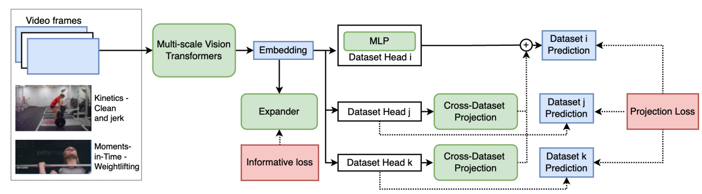

# MultiTrain

Code and model for "Multi-dataset Training of Transformers for Robust Action Recognition", NeurIPS 2022

[[Paper](https://arxiv.org/abs/2209.12362)]

If you find this code useful in your research then please cite

```
@article{liang2022multi,
  title={Multi-dataset Training of Transformers for Robust Action Recognition},
  author={Liang, Junwei and Zhang, Enwei and Zhang, Jun and Shen, Chunhua},
  journal={Advances in Neural Information Processing Systems},
  volume={35},
  pages={14475--14488},
  year={2022}
}
```

## Introduction

This work is on training robust models on multiple datasets for action recognition.
We design two new loss terms, namely informative loss and projection loss, aiming to learn robust representations.
In particular, the informative loss maximizes the expressiveness of the feature embedding while the projection loss for each dataset mines the
intrinsic relations between classes across datasets.
The backbone we use is a modified [MViT](https://arxiv.org/abs/2104.11227) and this code base
is based on [PySlowFast](https://github.com/facebookresearch/SlowFast).
We added `decord` for video decoding, gradient accumulation technique, multi-dataset loader,
and our training framework (See below).

<div align="center">
  
</div>

## Dependencies
+ Python 3.8; PyTorch 1.14; and other common packages that could be installed via pip or conda
+ We recommend using the docker image that we built from [nvidia docker 22.12](https://docs.nvidia.com/deeplearning/frameworks/pytorch-release-notes/rel-22-12.html)
from [DockerHub](https://hub.docker.com/r/junweiliang/base/tags):
```
$ docker pull junweiliang/base:v1.4
```

## Pretrained Models
As reported in the [supplementary material](https://openreview.net/attachment?id=aGFQDrNb-KO&name=supplementary_material)
and Table 1 (Ours-baseline),
we train the multi-dataset model from a [K400 checkpoint](https://drive.google.com/file/d/15mCux5ixwdaY3evzJLy5LnPpGi3YXCuT/view?usp=sharing).
This checkpoint achieves 79.8/93.9 on K400-val using 1x5 test (much lower than what MVITv2 paper reported).
Originally, the model is trained on 128 A100 GPUs for a few days.
We reproduce a close result with far less computational cost (two weeks on 16xA6000)
using techniques like gradient accumulation and a better dataset collection.
The checkpoint is released [here](https://drive.google.com/file/d/1EkFyPG4t-p60LqOiG2ZKAqxkHCwjjewf/view?usp=sharing).
The performance is listed below. So this single model can recognize a total of 879 action classes.
See the Inference part to reproduce the results on your local machine.

| K400      | MIT       | SSv2      | AVG-Top1 vs. Paper* |
|-----------|-----------|-----------|--------------------|
| 84.7/96.5 | 41.4/69.5 | 65.2/86.6 | 63.8 / 64.2*        |

*\*In the paper we have an additional ActivityNet training set.*


## Data preparation
Please prepare the three key datasets (Kinetics-400, Moments-in-Time v1, Something-Something-v2, including videos and labels)
using the following format:
```
$ tree -L 3 datasets/ --filelimit 5
datasets/
├── kinetics400
│     ├── pyslowfast_annotations
│     │     ├── test.csv
│     │     ├── train.csv
│     │     └── val.csv
│     └── videos_320p  [254343 entries exceeds filelimit, not opening dir]
├── moments_in_time
│     ├── pyslowfast_annotations
│     │     ├── test.csv
│     │     ├── train.csv
│     │     └── val.csv
│     └── videos_320p  [748135 entries exceeds filelimit, not opening dir]
└── ssv2
    ├── pyslowfast_annotations
    │     ├── test.csv
    │     ├── train.csv
    │     └── val.csv
    └── videos_320p  [220847 entries exceeds filelimit, not opening dir]

9 directories, 9 files
```
The annotations include the filenames and labels. They could be downloaded from Google Drive [here](https://drive.google.com/drive/folders/143farwtsLhhjYNnuirLTOH2VYcE6nD5G?usp=sharing).
The videos should be downloaded from their official sites.
Please prepare the videos in 320p if you want a speedup and rename the videos following the filenames in the csv files.
The whole three datasets with 320p videos should be around 311 GB.
Contact me if you want a copy (ask your professor/head-of-lab to send me a disk if you are in China).

## Inference

1. Download the [checkpoint](https://drive.google.com/file/d/1EkFyPG4t-p60LqOiG2ZKAqxkHCwjjewf/view?usp=sharing), prepare the code and data.
In the example below, we put the `datasets/` folder under `/mnt/nvme1/junweil`.
The code is put under `/mnt/nvme1/junweil/exps/multi_train`.

2. Start a docker container with our docker image (here we use a machine with 2xRTX 3090 GPUs as an example):
```
$ sudo docker run -it --shm-size=60g --gpus 2 --network=host -v /mnt/nvme1/junweil/exps/multi_train:/exps/ \
-v /mnt/nvme1/junweil/:/data_nvme junweiliang/base:v1.4 bash
```

3. Now we could run inference on the three datasets separately. For Kinetics-400 (takes about 1.5 hr):
```
/exps/test# export PYTHONPATH=/exps/MultiTrain/;num_class=400;datapath=kinetics400;dataset=kinetics;s=1;t=5; \
python $PYTHONPATH/tools/run_net.py --cfg $PYTHONPATH/configs/Multi_dataset/MVITV2_FULL_B_32x3_CONV_k400+mit+ssv2_docker.yaml \
DATA.MULTI_LABEL False TRAIN.ENABLE False TRAIN.BATCH_SIZE 1 NUM_GPUS 2 TEST.BATCH_SIZE 32 TEST.ENABLE True \
DATA_LOADER.NUM_WORKERS 8 LOG_PERIOD 100  DATA.DECODING_BACKEND decord LOG_MODEL_INFO False \
TEST.CHECKPOINT_FILE_PATH ../pretrained_models/multitrain_release.v1.pyth USE_TQDM True \
DATA.PATH_TO_DATA_DIR /data_nvme/datasets/${datapath}/pyslowfast_annotations/ \
DATA.PATH_PREFIX /data_nvme/datasets/${datapath}/videos_320p TEST.NUM_SPATIAL_CROPS ${s} \
TEST.NUM_ENSEMBLE_VIEWS ${t} TEST.DATASET ${dataset} MODEL.NUM_CLASSES ${num_class} \
DATA.NUM_CLASSES ${num_class} TEST.ENABLE_SAVE False DATA.MODEL_DIFF_DATA False \
TRAIN.DATASET ${dataset} MODEL.MULTI_ADD_CROSS_PROJ False MODEL.USE_INF_LOSS False
```

For moments-in-time, replace the corresponding part above with
`num_class=305;datapath=moments_in_time;dataset=mit;s=3;t=2;`

For Something-something-v2, replace the corresponding part above with
`num_class=174;datapath=ssv2;dataset=ssv2;s=3;t=1`

Change NUM_GPUS to 1 if you are only using 1 GPU. Reduce TEST.BATCH_SIZE accordingly if OOM.


## Training

Originally the training is done on 128 A100 GPUs for 2-4 days.
Here we could do it with 16 A6000 GPUs.
Our method is sensitive to batch size so we add gradient accumulation to the training.
So originally the batch size is 512 (distributed across 128 GPUs), here we set batch size to 64 and accumulation step to 8, which should be equivalent.
Training with K400+MIT+SSv2 datasets for 50 epochs on 2 8xA6000 machines (so 16xA6000 GPUs) takes 15 days.
Here are the steps:

1. Download the [K400 checkpoint](https://drive.google.com/file/d/15mCux5ixwdaY3evzJLy5LnPpGi3YXCuT/view?usp=sharing), prepare the code and data.

2. Start a docker with our docker image.
Suppose the code is at
`/remote-home/junweil/exps/multi_train/MultiTrain` and the data is at `/remote-home/share/video_datasets/`.
You will need to change the yaml file to the correct data path.
Run the following command on the master node:
```
train_test# export PYTHONPATH=/remote-home/junweil/exps/multi_train/MultiTrain/; \
pretrain_path=/remote-home/junweil/exps/multi_train/pretrained_models/k400_train_mvitV2_full_32x3_e200_b512_release.pyth; \
python $PYTHONPATH/tools/run_net.py --cfg $PYTHONPATH/configs/Multi_dataset/MVITV2_FULL_B_32x3_CONV_k400+mit+ssv2_cluster_example.yaml \
TRAIN.ENABLE True TRAIN.BATCH_SIZE 64 TRAIN.GRAD_ACCU_NUM_BATCH 8 NUM_GPUS 8 LOG_PERIOD 500 TRAIN.MIXED_PRECISION True \
DATA.DECODING_BACKEND decord MODEL.ACT_CHECKPOINT False LOG_MODEL_INFO False \
TRAIN.CHECKPOINT_FILE_PATH ${pretrain_path} TRAIN.AUTO_RESUME True \
TRAIN.CHECKPOINT_EPOCH_RESET True TENSORBOARD.ENABLE True TENSORBOARD.LOG_DIR tb_log USE_TQDM True  \
--init_method "tcp://10.0.1.6:23456" --num_shards 2 --shard_id 0

```

The `--init_method "tcp://10.0.1.6:23456"` indicates the IP address for the master node in the compute network.
The port can be arbitrary.
For the other nodes, simply change `--shard_id` to the correct rank ID and run the same command to start multi-node DDP.
To run it on a single machine, change `--num_shards` to 1 and remove `--init_method`.
We don't recommend training with a single machine as it would take too long.

One sample takes about 12GB GPU memory with RandAug=2 and mixed_precision=True.
Gradient checkpointing (MODEL.ACT_CHECKPOINT=True) could reduce GPU memory usage by half but it is 10-30% slower.


## Acknowledgments & Disclaimer
The code is based on [PySlowFast](https://github.com/facebookresearch/SlowFast).
There are plenty of "junk"/experimental code in this repo and I might not have time to clean them up.
This repo is only intended to reproduce the training (with a lower computational cost) and testing of our NeurIPS paper.

